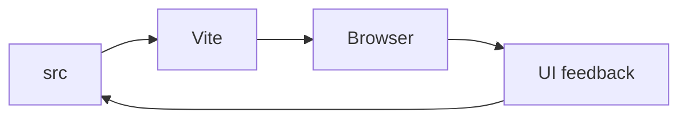

# 🤖 SFAIwala Copy

<p align="center"></p>

A Vite-based frontend project with source code under `src/` and static assets under `public/`.

## 🛠️ Stack
Vite · JavaScript · ESLint

## 🚀 Setup
```bash
git clone https://github.com/Abhishek7258/sfaiwalacopy.git
cd sfaiwalacopy
npm install
npm run dev
```

Use `package.json` for the authoritative development/build/lint scripts.

## 📁 Structure
```text
sfaiwalacopy/
├── public/
├── src/
├── index.html
├── package.json
├── vite.config.js
└── eslint.config.js
```

## 🔄 Development Flow


## 🖼️ Screenshots
Add approved desktop/mobile screenshots under `docs/screenshots/` for a stronger project presentation.

## 📄 License
No license file is currently declared.